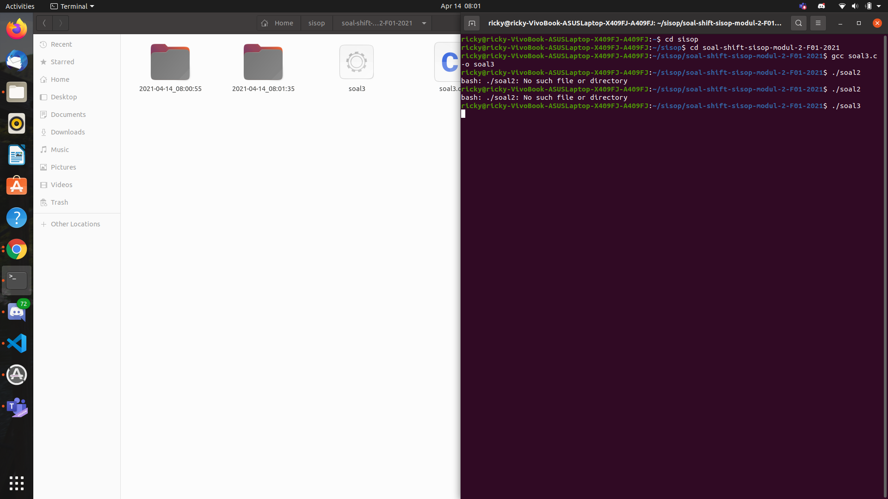
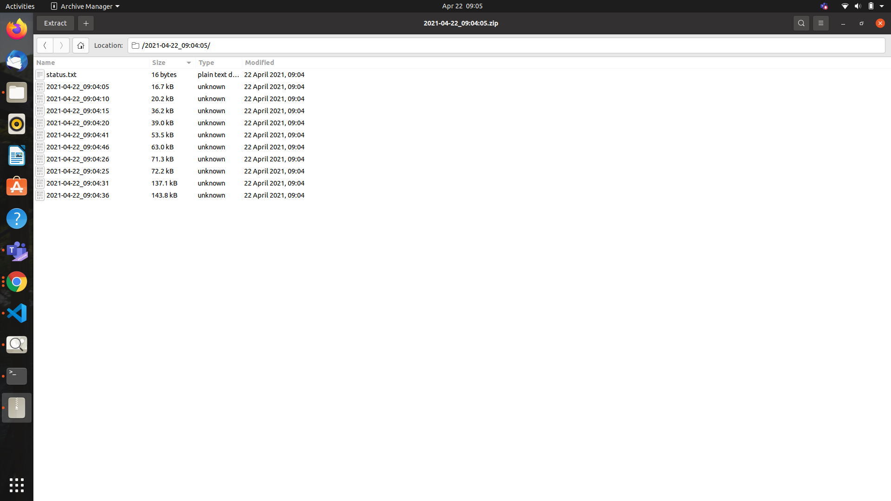
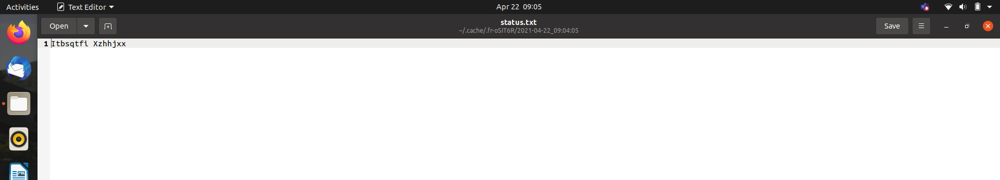
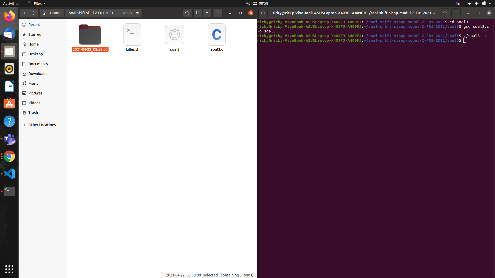
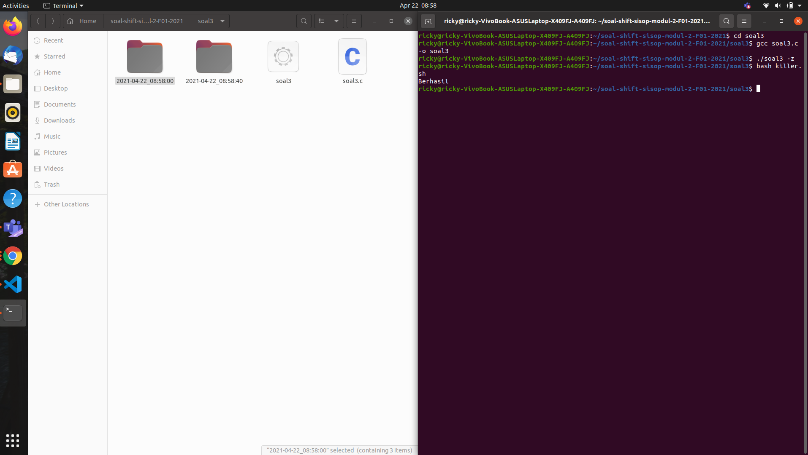
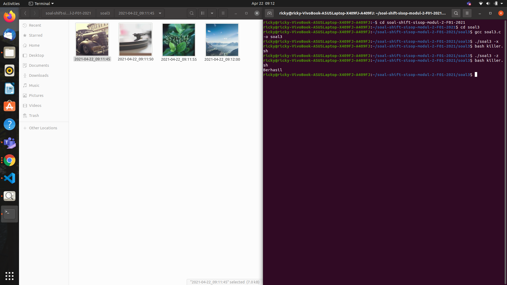
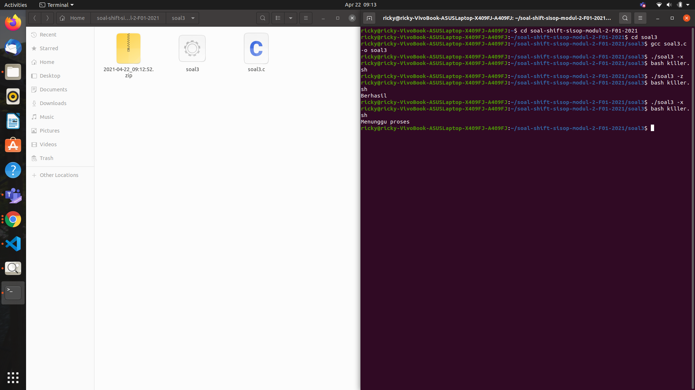

# soal-shift-sisop-modul-2-F01-2021

## Source Code
- [Soal 1](https://github.com/azhar416/soal-shift-sisop-modul-2-F01-2021/blob/main/soal1/soal1.c)
- [Soal 2](https://github.com/azhar416/soal-shift-sisop-modul-2-F01-2021/blob/main/soal2/soal2.c)
- [Soal 3]()

## Soal Nomor 1
Pada suatu masa, hiduplah seorang Steven yang hidupnya pas-pasan. Steven punya pacar, namun sudah putus sebelum pacaran. Ketika dia galau memikirkan mantan, ia selalu menonton https://www.youtube.com/watch?v=568DH_9CMKI untuk menghilangkan kesedihannya. 

Di lain hal Steven anak yang tidak amat sangat super membenci matkul sisop, beberapa jam setelah diputus oleh pacarnya dia menemukan wanita lain bernama Stevany, namun Stevany berkebalikan dengan Steven karena menyukai sisop. Steven ingin terlihat jago matkul sisop demi menarik perhatian Stevany.

Pada hari ulang tahun Stevany, Steven ingin memberikan Stevany zip berisikan hal-hal yang disukai Stevany. Steven ingin isi zipnya menjadi rapi dengan membuat folder masing-masing sesuai extensi. (a) Dikarenakan Stevany sangat menyukai huruf Y, Steven ingin nama folder-foldernya adalah Musyik untuk mp3, Fylm untuk mp4, dan Pyoto untuk jpg (b) untuk musik Steven mendownloadnya dari link di bawah, film dari link di bawah lagi, dan foto dari link dibawah juga :). (c) Steven tidak ingin isi folder yang dibuatnya berisikan zip, sehingga perlu meng-extract-nya setelah didownload serta (d) memindahkannya ke dalam folder yang telah dibuat (hanya file yang dimasukkan).

(e) Untuk memudahkan Steven, ia ingin semua hal di atas berjalan otomatis 6 jam sebelum waktu ulang tahun Stevany). (f) Setelah itu pada waktu ulang tahunnya Stevany, semua folder akan di zip dengan nama Lopyu_Stevany.zip dan semua folder akan di delete(sehingga hanya menyisakan .zip).
Kemudian Steven meminta bantuanmu yang memang sudah jago sisop untuk membantunya mendapatkan hati Stevany. Bantu Woy!!

### Penjelasan
Dari soal narasi panjang diatas, kita mengetahui bahwa kita diminta untuk membuat sebuah Daemon Program untuk melakukan banyak hal seperti membuat directory, men-download sebuah zip file yang kemudian akan di-extract, melakukan zip, dan juga menghapus sebuah folder. Terlebih lagi program tersebut akan berjalan pada waktu yang telah ditentukan yaitu untuk membuat directory, men-download file, dan juga meng-extract isinya yang kemudian dipindahkan ke directory yang telah dibuat pada 9 APRIL pukul 16:22 atau 6 jam sebelum ulang tahunnya Stevany. Untuk melakukan zip pada directory yang berisi hasil extract file yang di download dilakukan pada 9 APRIL pukul 22:22 atau tepat pada jam ulang tahunnya. Setelah melakukan zip, directory tersebut akan dihapus.

untuk menjawab permasalahan tersebut, saya membuat banyak fungsi untuk memisahkan setiap kegiatan yang dijalankan.
pada fungsi main-nya sendiri hanya akan berisi template daemon dan fungsi - fungsi dari kegiatan yang akan dijalankan.

```C++
void mekdir()
{
    pid_t mkdir3;
    int status;

    mkdir3 = fork();
    if (mkdir3 == 0) {
        pid_t mkdir2;
        int status;

        mkdir2 = fork();
        if (mkdir2 == 0) 
        {
            char *argv2[] = {"mkdir", "-p", "/home/azhar416/soal-shift-sisop-modul-2-F01-2021/soal1/Pyoto", NULL};
            execv("/bin/mkdir", argv2);
        } 
        else 
        {
            while (wait(&status) > 0);
            char *argv1[] = {"mkdir", "-p", "/home/azhar416/soal-shift-sisop-modul-2-F01-2021/soal1/Myusik", NULL};
            execv("/bin/mkdir", argv1);
        }
    } 
    else 
    {
        while (wait(&status) > 0);
        char *argv3[] = {"mkdir", "-p", "/home/azhar416/soal-shift-sisop-modul-2-F01-2021/soal1/Fylm", NULL};
        execv("/bin/mkdir", argv3);
    }
}
```
fungsi `mekdir()` diatas berfungsi untuk membuat directory Pyoto, Myusik, dan juga Fylm.

```C++
void donlot()
{
    pid_t donlot3;
    int status;

    donlot3 = fork();
    if (donlot3 == 0) {
        pid_t donlot2;
        int status;

        donlot2 = fork();
        if (donlot2 == 0) 
        {
            char *argv2[] = {"wget", "-q", "--no-check-certificate", "https://drive.google.com/uc?id=1FsrAzb9B5ixooGUs0dGiBr-rC7TS9wTD&export=download", "-O", "Foto_for_Stevany.zip", NULL};
            execv("/bin/wget", argv2);
        } 
        else 
        {
            while (wait(&status) > 0);
            char *argv1[] = {"wget", "-q", "--no-check-certificate", "https://drive.google.com/uc?id=1ZG8nRBRPquhYXq_sISdsVcXx5VdEgi-J&export=download", "-O", "Musik_for_Stevany.zip", NULL};
            execv("/bin/wget", argv1);
        }
    } 
    else 
    {
        while (wait(&status) > 0);
        char *argv3[] = {"wget", "-q", "--no-check-certificate", "https://drive.google.com/uc?id=1ktjGgDkL0nNpY-vT7rT7O6ZI47Ke9xcp&export=download", "-O", "Film_for_Stevany.zip", NULL};
        execv("/bin/wget", argv3);
    }
}
```
fungsi `donlot()` diatas berfungsi untuk mendownload zip dari yang telah disediakan oleh soal.

```C++
void ekstrak()
{
    pid_t eks3;
    int status;

    eks3 = fork();
    if (eks3 == 0) {
        pid_t eks2;
        int status;

        eks2 = fork();
        if (eks2 == 0) 
        {
            char *argv2[] = {"unzip", "-qq", "Foto_for_Stevany.zip", "-d", "/home/azhar416/soal-shift-sisop-modul-2-F01-2021/soal1/Pyoto/", NULL};
            execv("/bin/unzip", argv2);
        } 
        else 
        {
            while (wait(&status) > 0);
            char *argv1[] = {"unzip", "-qq", "Musik_for_Stevany.zip", "-d", "/home/azhar416/soal-shift-sisop-modul-2-F01-2021/soal1/Myusik/", NULL};
            execv("/bin/unzip", argv1);
        }
    } 
    else 
    {
        while (wait(&status) > 0);
        char *argv3[] = {"unzip", "-qq", "Film_for_Stevany.zip", "-d", "/home/azhar416/soal-shift-sisop-modul-2-F01-2021/soal1/Fylm/", NULL};
        execv("/bin/unzip", argv3);;    
    }
}
```
fungsi `ekstrak()` diatas berfungsi untuk melakukan unzip dari file zip yang telah di-download.

```C++
void copy()
{
    pid_t cp3;
    int status;

    cp3 = fork();
    if (cp3 == 0) {
        pid_t cp2;
        int status;

        cp2 = fork();
        if (cp2 == 0) 
        {
            char *argv2[] = {"cp", "-r", "/home/azhar416/soal-shift-sisop-modul-2-F01-2021/soal1/Pyoto/FOTO/.", "/home/azhar416/soal-shift-sisop-modul-2-F01-2021/soal1/Pyoto/", NULL};
            execv("/bin/cp", argv2);
        } 
        else 
        {
            while (wait(&status) > 0);
            char *argv1[] = {"cp", "-r", "/home/azhar416/soal-shift-sisop-modul-2-F01-2021/soal1/Myusik/MUSIK/.", "/home/azhar416/soal-shift-sisop-modul-2-F01-2021/soal1/Myusik/", NULL};
            execv("/bin/cp", argv1);
        }
    } 
    else 
    {
        while (wait(&status) > 0);
        char *argv3[] = {"cp", "-r", "/home/azhar416/soal-shift-sisop-modul-2-F01-2021/soal1/Fylm/FILM/.", "/home/azhar416/soal-shift-sisop-modul-2-F01-2021/soal1/Fylm/", NULL};
        execv("/bin/cp", argv3); 
    }
}
```
```C++
void ngapus()
{
    pid_t rm3;
    int status;

    rm3 = fork();
    if (rm3 == 0) {
        pid_t rm2;
        int status;

        rm2 = fork();
        if (rm2 == 0) 
        {
            char *argv2[] = {"rm", "-rf", "/home/azhar416/soal-shift-sisop-modul-2-F01-2021/soal1/Pyoto/FOTO", NULL};
            execv("/bin/rm", argv2);
        } 
        else 
        {
            char *argv1[] = {"rm", "-rf", "/home/azhar416/soal-shift-sisop-modul-2-F01-2021/soal1/Myusik/MUSIK", NULL};
            execv("/bin/rm", argv1);
        }
    } 
    else 
    {
        while (wait(&status) > 0);
        char *argv3[] = {"rm", "-rf", "/home/azhar416/soal-shift-sisop-modul-2-F01-2021/soal1/Fylm/FILM", NULL};
        execv("/bin/rm", argv3);    
    }
}
```
fungsi `copy()` akan melakukan copy data - data dari folder MUSIK, FILM, FOTO ke directory Myusik, Fylm, dan Pyoto. setelah di copy, folder MUSIK, FILM, dan FOTO akan dihapus oleh fungsi `ngapus()`.

```C++
void ngezip()
{
    pid_t zip3;
    int status;

    zip3 = fork();
    if (zip3 == 0) {
        
        char *argv0[] = {"zip", "-qr", "Lopyu_Stevany.zip", "/home/azhar416/soal-shift-sisop-modul-2-F01-2021/soal1/Fylm/", "/home/azhar416/soal-shift-sisop-modul-2-F01-2021/soal1/Myusik/", "/home/azhar416/soal-shift-sisop-modul-2-F01-2021/soal1/Pyoto/", NULL};
        execv("/bin/zip", argv0);
    } 
    else 
    {
        while (wait(&status) > 0);
        pid_t rem3;
        int status;

        rem3 = fork();
        if (rem3 == 0) 
        {
            pid_t rem2;
            int status;

            rem2 = fork();
            if (rem2 == 0) 
            {
                // remove Pyoto
                while (wait(&status) > 0);
                char *argv2[] = {"rm", "-rf", "/home/azhar416/soal-shift-sisop-modul-2-F01-2021/soal1/Pyoto", NULL};
                execv("/bin/rm", argv2);
            } 
            else 
            {
                // remove Myusik
                while (wait(&status) > 0);
                char *argv1[] = {"rm", "-rf", "/home/azhar416/soal-shift-sisop-modul-2-F01-2021/soal1/Myusik", NULL};
                execv("/bin/rm", argv1);
            }
        } 
        else 
        {
            // remove Fylm
            while (wait(&status) > 0);
            char *argv3[] = {"rm", "-rf", "/home/azhar416/soal-shift-sisop-modul-2-F01-2021/soal1/Fylm", NULL};
            execv("/bin/rm", argv3);  
        }
    }
}
```
fungsi `ngezip()` diatas berfungsi untuk melakukan zip pada 3 directory yaitu Myusik, Fylm, Pyoto. Setelah itu ketiga directory tersebut akan dihapus.

untuk fungsi main nya sendiri
```C++
int main() 
{
    pid_t pid, sid;        
    pid = fork();     

    if (pid < 0) {
        exit(EXIT_FAILURE);
    }

    /* Keluar saat fork berhasil
    * (nilai variabel pid adalah PID dari child process) */
    if (pid > 0) {
        exit(EXIT_SUCCESS);
    }

    umask(0);

    sid = setsid();
    if (sid < 0) {
        exit(EXIT_FAILURE);
    }

    if ((chdir("/home/azhar416/soal-shift-sisop-modul-2-F01-2021/soal1/")) < 0) 
    {
        exit(EXIT_FAILURE);
    }

    close(STDIN_FILENO);
    close(STDOUT_FILENO);
    close(STDERR_FILENO);

    while (1) 
    {
        char tgl[100];
        time_t sekon = time(NULL);
        struct tm time = *localtime(&sekon);
        strftime(tgl, sizeof(tgl), "%d-%m_%H:%M", &time);
        // Tulis program kalian di sini
        if (strcmp(tgl, "09-04_16:22") == 0)
        {
            pid_t child1;
            int status;
    
            child1 = fork();
    
            if (child1 < 0) {
                exit(EXIT_FAILURE); 
            }
    
            if (child1 == 0) 
            {
                id_t child2;
                int status;
    
                child2 = fork();
                if (child2 == 0) 
                {
                    id_t child3;
                    int status;
    
                    child3 = fork();
                    if (child3 == 0) 
                    {
                        id_t child4;
                        int status;
    
                        child4 = fork();
                        if (child4 == 0)
                        {
                            mekdir();
                        } 
                        else 
                        {
                            while (wait(&status) > 0);
                            donlot();
                        }
                    } 
                    else 
                    {
                        while (wait(&status) > 0);
                        sleep(10);
                        ekstrak();
                    }
                } 
                else 
                {
                    while (wait(&status) > 0);
                    copy();
                }
            } 
            else
            {
                while (wait(&status) > 0);
                
                pid_t debug = fork();
                int status;

                if (debug == 0)
                {
                    ngapus();
                }
                else
                {
                    while (wait(&status) > 0);
                }
            }
        }
        else if (strcmp(tgl, "09-04_22:22") == 0)
        {
            pid_t debug = fork();
            int status;

            if (debug == 0)
            {
                ngezip();
            }
            else
            {
                while (wait(&status) > 0);
            }
        }
        sleep(1);
    }
}
```
pada fungsi main ini setiap ingin melakukan panggilan pada fungsi, akan di fork terlebih dahulu agar program tidak terminate. untuk daemonnya sendiri kami menggunakan template dari github agar dapat berjalan terus pada background.

## Soal Nomor 2
Loba bekerja di sebuah petshop terkenal, suatu saat dia mendapatkan zip yang berisi banyak sekali foto peliharaan dan Ia diperintahkan untuk mengkategorikan foto-foto peliharaan tersebut. Loba merasa kesusahan melakukan pekerjaanya secara manual, apalagi ada kemungkinan ia akan diperintahkan untuk melakukan hal yang sama. Kamu adalah teman baik Loba dan Ia meminta bantuanmu untuk membantu pekerjaannya.

### Penjelasan
Soal diatas meminta untuk membuat sebuah program untuk membuat directory, mengextract sebuah zip file yang kemudian akan dipindahkan ke directory yang baru dibuat dengan format nama file yang ditentukan setelah diidentifikasi nama file nya, serta membaca dan menyimpan beberapa informasi dari nama file ke dalam sebuah file txt.

Membuat fungsi rekursif untuk mengeksekusi script
```c
    void executeRecur (pid_t pid, int status, char script[], char *argv[]){
    pid = fork();
    if (!(pid != 0)) execv(script, argv);
    else while((wait(&status)) > 0);
}
```

### A. Pertama-tama program perlu mengextract zip yang diberikan ke dalam folder “/home/[user]/modul2/petshop”. Karena bos Loba teledor, dalam zip tersebut bisa berisi folder-folder yang tidak penting, maka program harus bisa membedakan file dan folder sehingga dapat memproses file yang seharusnya dikerjakan dan menghapus folder-folder yang tidak dibutuhkan.

Fungsi dibawah ini untuk membuat direktori untuk menampung hasil extract. `-p (parent)` untuk membuat parent direktori jika dibutuhkan
``` c
    #define createProcess {"buat_folder", "-p", path, NULL}

    void createFolder(pid_t mkdir, int status){
    mkdir = fork();
    if (!(mkdir != 0)) {
        char *createNewFolder[] = createProcess;
        executeRecur(mkdir, status, "/usr/bin/mkdir", createNewFolder);
    }
    while ((wait(&status)) > 0);
}
```

Fungsi dibawah ini untuk mengunzip file yang ditentukan. Pada proses dibawah ini akan mengextract pets.zip ke dalam path tujuan namun mengecualikan folder yang tidak dibutuhkan. 
`-q` agar tidak menampilkan output informasi yang sedang dikerjakan program.
`-x (exclude)` */* -d (cth : ../petshop/apex) jadi mengecualikan folder dalam source untuk di-unzip
``` c
    #define unzipProcess {"unzip_file", "-q", source, "-x", "*/*", "-d", path, NULL}

    void extractFile(pid_t extract, int status) {
        extract = fork();
        if (!(extract != 0)) {
            char *extractZipFile[] = unzipProcess;
            executeRecur(extract, status, "/usr/bin/unzip", extractZipFile);
        }
        while ((wait(&status)) > 0);
    }
```

``` c
    void unzipFile(pid_t child_id, int status){
        child_id = fork();
        if (!(child_id != 0)) createFolder(child_id, status); // buat folder baru di path yang ditentukan
        else {
            while((wait(&status)) > 0);
            extractFile(child_id, status);
        }
    }
```

### B. Foto peliharaan perlu dikategorikan sesuai jenis peliharaan, maka kamu harus membuat folder untuk setiap jenis peliharaan yang ada dalam zip. Karena kamu tidak mungkin memeriksa satu-persatu, maka program harus membuatkan folder-folder yang dibutuhkan sesuai dengan isi zip. Contoh: Jenis peliharaan kucing akan disimpan dalam “/petshop/cat”, jenis peliharaan kura-kura akan disimpan dalam “/petshop/turtle”.

Membuat array untuk menyimpan string jenis hewan dari setiap file yang ada dalam folder petshop dan array untuk menyimpan path file (cth : petshop/cat). Lalu nantinya akan membuat folder sesuai dengan path yang disimpan dalam array.
``` c
    DIR *dir = opendir(path);
        struct dirent *dp;
        if (dir){
            while ((dp = readdir(dir)) != NULL){
                // ini buat bolak balik masuk folder sama keluar
                if (strcmp(dp->d_name, ".") != 0 && strcmp(dp->d_name, "..") != 0){

                    char namafile[1000];
                    // dp -> d_name masih nama file yg cat;ava;6_dog;joni;8.jpg
                    strcpy(namafile, dp->d_name);
                    // buat token untuk setiap jenis hewan
                    char *cut = strtok(namafile, ";");
                    char folder[100];
                    strcpy(folder, path);
                    strcat(folder, cut);

                    // FORK 1
                    pid_t anak = fork();
                    if(anak<0) exit(EXIT_FAILURE);
                    if(anak==0){
                        char *newFolder[] = {"mkdir", "-p", folder, NULL};
                        execv("/usr/bin/mkdir", newFolder);
                    }
```

### C & D. Setelah folder kategori berhasil dibuat, programmu akan memindahkan foto ke folder dengan kategori yang sesuai dan di rename dengan nama peliharaan. Contoh: “/petshop/cat/joni.jpg”. Karena dalam satu foto bisa terdapat lebih dari satu peliharaan maka foto harus di pindah ke masing-masing kategori yang sesuai. Contoh: foto dengan nama “dog;baro;1_cat;joni;2.jpg” dipindah ke folder “/petshop/cat/joni.jpg” dan “/petshop/dog/baro.jpg”.

Membuat fungsi untuk memotong .jpg dari nama file
``` c
    char* cut_four (char* s){
    int n;
    int i;
    char* new;
    for (i = 0; s[i] != '\0'; i++);
    // length of the new string
    n = i - 4 + 1;
    if (n < 1)
        return NULL;
    new = (char*) malloc (n * sizeof(char));
    for (i = 0; i < n - 1; i++)
        new[i] = s[i];
    new[i] = '\0';
    return new;
}
```

Memisahkan hewan yang dipisahkan dengan _ dan atribut tiap hewan dengan ;
``` c
    while(wait(NULL) > 0);
    char namadir[1000];
    strcpy(namadir, dp->d_name);
    char *anothercut = cut_four(namadir);
    char *token;
    while (token = strtok_r(anothercut, "_", &anothercut)){
    while(wait(NULL) > 0);
    char *temp = token;
    char *token2;
    int i = 0;
    char jenis[100], nama[100], umur[100];
    while (token2 = strtok_r(temp, ";", &temp)){
        while(wait(NULL) > 0);
        if (i == 0){
            strcpy(jenis, token2);
        }
        if (i == 1){
            strcpy(nama, token2);
        }
        if (i == 2){
            strcpy(umur, token2);
        }
        i++;
    }
```

Menyalin file dari path ke destination
``` c
    //FORK 2
    if (fork() == 0){
        // path/petshop/[file].jpg
        char sc[1000];
        strcpy(sc, path);
        strcat(sc, dp->d_name);

        // path/petshop/[jenishewan]/[namahewan].jpg
        char dest[1000];
        strcpy(dest, path);
        strcat(dest, jenis);
        strcat(dest, "/");
        strcat(dest, nama);
        strcat(dest, ".jpg");
                                
        char *argcp[] = {"cp", sc, dest, NULL};
        execv("/bin/cp", argcp); 
    }
```

### E. Di setiap folder buatlah sebuah file "keterangan.txt" yang berisi nama dan umur semua peliharaan dalam folder tersebut. Format harus sesuai contoh.

Membuat array untuk menampung isi file keterangan.txt dan array untuk path keterangan.txt. Menggunakan file untuk membuka keterangan.txt dan memasukkan array isi ke file tersebut.
``` c
    else{
        while(wait(NULL) > 0);
        char isi[1000] = "Nama : ";
        strcat(isi, nama);
        strcat(isi, "\nUmur : ");
        strcat(isi, umur);
        strcat(isi, " tahun\n\n");

        char f[1000];
        strcpy(f, path);
        strcat(f, jenis);
        strcat(f, "/keterangan.txt");
                                
        FILE* files = fopen(f, "a");
        fputs(isi, files);
        fclose(files);
    }
```

## Soal Nomor 3
Ranora adalah mahasiswa Teknik Informatika yang saat ini sedang 
menjalani magang di perusahan ternama yang bernama “FakeKos Corp.”
,perusahaan yang bergerak dibidang keamanan data. Karena Ranora 
masih magang, maka beban tugasnya tidak sebesar beban tugas pekerja 
tetap perusahaan. Di hari pertama Ranora bekerja, pembimbing magang
Ranora memberi tugas pertamanya untuk membuat sebuah program.

### A. Ranora harus membuat sebuah program C yang dimana setiap 40 detik membuat sebuah direktori dengan nama sesuai timestamp [YYYY-mm-dd_HH:ii:ss].

Pada kasus ini menggunakan fungsi `strftime` dan menggunakan `fork` 
dan `execv` untuk membuat directory. Selang waktu yang diberikan
yaitu 40 detik maka `sleep(40)`.

```
s = 1;
    while(s)
    {
        // 3a. Membuat mkdir dengan nama waktu sesuai soal
        pid_t child_id;
        time_t s1 = time(NULL);
        struct tm* t1= localtime(&s1);
        strftime(curr, 40, "%Y-%m-%d_%H:%M:%S" , t1);

        child_id = fork();
        if (child_id < 0)
        {
            exit(0);
        }
        if(child_id==0)
        {
            char *argv[] = {"mkdir", curr, NULL};
            execv("/bin/mkdir", argv);
        }
                sleep(40);
    }
```



### B. Setiap direktori yang sudah dibuat diisi dengan 10 gambar yang didownload dari https://picsum.photos/, dimana setiap gambar akandidownload setiap 5 detik. Setiap gambar yang didownload akan diberi nama dengan format timestamp [YYYY-mm-dd_HH:ii:ss] dan gambar tersebut berbentuk persegi dengan ukuran (n%1000) + 50 pixel dimana n adalah detik Epoch Unix.

Pada kasus ini akan mendownload 10 foto menggunakan looping `for`
untuk jeda `sleep(5)`. Penamaan file menggunakan waktu dan memakai 
`strftime`. 

```
chdir(curr);
            for(int i=0;i<10;i++){
                time_t s2 = time(NULL);
                struct tm* t2= localtime(&s2);
                strftime(curr2, 40, "%Y-%m-%d_%H:%M:%S", t2);
                sprintf(link , "https://picsum.photos/%ld", (s2 % 1000) + 50);
                
                child_id3 = fork();
                if(child_id3<0)
                {
                    exit(0);
                }
                if(child_id3==0)
                {
                    char *argv[]= {"wget", link, "-O", curr2, "-o", "/dev/null", NULL};
                    execv("/usr/bin/wget", argv);
                }
                sleep(5);
            }
```
Pada dokumentasi yang didapat sudah masuk dalam bentuk folder zip


### C. Setelah direktori telah terisi dengan 10 gambar, program tersebut akan membuat sebuah file “status.txt”, dimana didalamnya berisi pesan “Download Success” yang terenkripsi dengan teknik Caesar Cipher dan denganshift 5. Caesar Cipher adalah Teknik enkripsi sederhana yang dimana dapat melakukan enkripsi string sesuai dengan shift/key yang kita tentukan. Misal huruf “A” akan dienkripsi dengan shift 4 maka akan menjadi “E”. Karena Ranora orangnya perfeksionis dan rapi, dia ingin setelah file tersebut dibuat, direktori akan di zip dan direktori akan didelete, sehingga menyisakan hanya file zip saja.

Ada 2 kasus yang pertama yaitu setelah melakukan proses `download` akan membuat 
status.txt dimana akan menampilkan hasil `Download Success` dengan menggunakan
Caesar Cipher Shift 5
```
char str_message[100] = "Download Success";

            //3c. Caesar cipher shift 5
            for(int j = 0; str_message[j] != '\0'; ++j)
            {
                char ch = str_message[j];

                if(ch >= 'a' && ch <= 'z')
                {
                    ch = ch + 5;
                    if(ch > 'z')
                    {
                        ch = ch - 'z' + 'a' - 1;
                    }
                    str_message[j] = ch;
                }

                else if(ch >= 'A' && ch <= 'Z')
                {
                    ch = ch + 5;
                    if(ch > 'Z')
                    {
                        ch = ch - 'Z' + 'A' - 1;
                    }
                    str_message[j] = ch;
                }
            }
            
            FILE* caesarc = fopen("status.txt", "w");
            fprintf(caesarc,"%s",str_message);
            fclose(caesarc);
```

Berikut hasil dari Caesar Cipher.


Untuk kendala dalam percobaan yaitu data yang ditampikan tidak sesuai dengan kaidah Caesar Cipher.

Setelah itu semua foto beserta status.txt akan dibuat zip dan direktori akan
terhapus.Berikut implementasi nya
```
void zipmode()
{
    pid_t child_id4;
    chdir("..");
    strcpy(curr3, curr);
    strcat(curr3, ".zip");

    child_id4 = fork();
    if(child_id4 < 0) exit(0);
    if(child_id4 == 0)
    {
        char *argv[] = {"zip", "-r", curr3, curr, NULL};
        execv("/usr/bin/zip", argv);
    }
}
```

Untuk menghapus direktori
```
void hapus(){
    pid_t child_id5;
    child_id5 = fork();
	if(child_id5 < 0) exit(0);
    if(child_id5 == 0)
    {
        char *argv[] = {"rm", "-r", curr, NULL};
    	execv("/bin/rm", argv);
    }
}
```


### D. Untuk mempermudah pengendalian program, pembimbing magang Ranora ingin program tersebut akan men-generate sebuah program “Killer” yang executable, dimana program tersebut akan menterminasi semua proses program yang sedang berjalan dan akan menghapus dirinya sendiri setelah program dijalankan. Karena Ranora menyukai sesuatu hal yang baru, maka Ranora memiliki ide untuk program “Killer” yang dibuat nantinya harus merupakan program bash.

Pada proses ini akan membuat file menggunakan program bash dengan nama `killer.sh`.
Pada killer.sh akan berisi kill pid() dan `rm` pada file itu sendiri
```
        FILE *new;
        new = fopen("killer.sh","w");
        fputs("#!/bin/bash\nkillall soal3\n rm killer.sh\necho \'Berhasil\'",new);
        fclose(new);
```


Setelah melakukan bash `killer.sh`program akan berhenti secara sendirinya dan tidak `killer.sh` akan terhapus


### E. Pembimbing magang Ranora juga ingin nantinya program utama yang dibuat Ranora dapat dijalankan di dalam dua mode. Untuk mengaktifkan mode pertama, program harus dijalankan dengan argumen -z, dan Ketika dijalankan dalam mode pertama, program utama akan langsung menghentikan semua operasinya Ketika program Killer dijalankan. Sedangkan untuk mengaktifkan mode kedua, program harus dijalankan dengan argumen -x, dan Ketika dijalankan dalam mode kedua, program utama akan berhenti namun membiarkan proses di setiap direktori yang masih berjalan hingga selesai (Direktori yang sudah dibuat akan mendownload gambar sampai selesai dan membuat file txt, lalu zip dan delete direktori).

Pada kasus ini untuk pembuatan file `killer.sh` menggunakan kondisi if else
```
    if(argv[1][1]=='z'){
        FILE *new;
        new = fopen("killer.sh","w");
        fputs("#!/bin/bash\nkillall soal3\n rm killer.sh\necho \'Berhasil\'",new);
        fclose(new);
    }
    if(argv[1][1]=='x'){ 
        FILE *new;
        new = fopen("killer.sh","w");
        fputs("#!/bin/bash\nkillall -15 soal3\n rm killer.sh\necho \'Menunggu proses\'",new);
        fclose(new);

        // memberi signal dan mengisi signal jadi 0
        signal(SIGTERM,op);
     }
```
signal(SIGTERM,op) yaitu penggunaan ophran dimana proses akan dihentikan setelah 
semua proses for dan zip dilakukan. Pada kasus ini diberikan
```
    if (s ==0) 
    {
        break;
    }

``` 
Dimana pada akhir process akan dilakukan pengecekan. Jika s == 0 maka process akan
berhenti.

Pada proses `-z`


Pada proses `-x`

